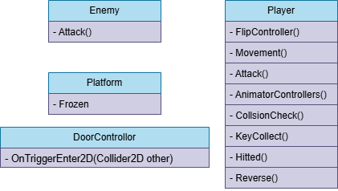

# **Player**
这个类最复杂，应2个人来完成：
- FlipController()   
控制转向
- Movement()   
控制角色移动，不能跳
- Attack()    
控制角色攻击
- AnimatorControllers()   
控制玩家动画
- CollsionCheck()
检测是否碰撞墙体，怪物
- KeyCollect()   
收集钥匙后改变持有钥匙数量
- Reverse()      
反转重力

# **Enemy**  
- Attack()    
怪物攻击

# **Platform**    
- Frozen()    
弹幕打中平台结冰

# **DoorControllor**
- OnTriggerEnter2D(Collider2D other)    
通关触发器，钥匙够了按f开门通关      

# 类图
